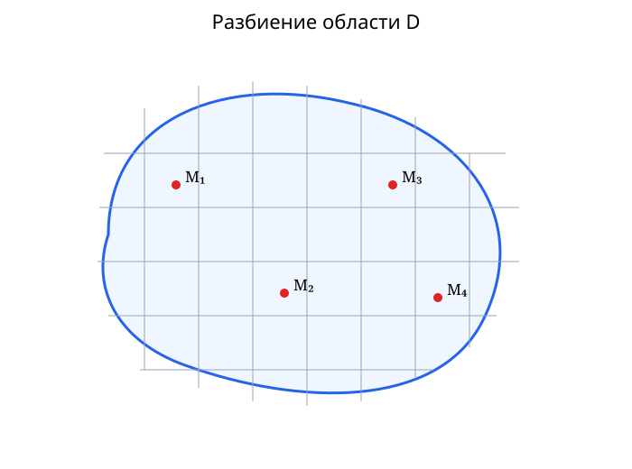
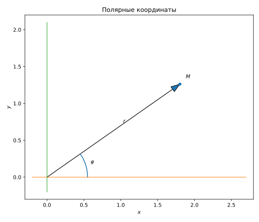

[[01 — Числовые ряды|← Числовые ряды]] · [[База знаний|К содержанию]] · [[03 — Тройные интегралы|Тройные интегралы →]]

## Содержание раздела

- [16. Разбиение области и интегральная сумма](#16. Разбиение области и интегральная сумма)
- [16.1. Квадрируемые области и площадь по Жордану](#16.1. Квадрируемые области и площадь по Жордану)
- [17. Определение двойного интеграла Римана](#17. Определение двойного интеграла Римана)
- [18. Необходимое условие интегрируемости](#18. Необходимое условие интегрируемости)
- [19. Критерий Дарбу и существование интеграла](#19. Критерий Дарбу и существование интеграла)
- [19.1. Классы интегрируемых функций](#19.1. Классы интегрируемых функций)
- [20. Множества площади нуль](#20. Множества площади нуль)
- [21. Основные свойства двойного интеграла](#21. Основные свойства двойного интеграла)
- [22. Теорема о среднем для двойного интеграла](#22. Теорема о среднем для двойного интеграла)
- [23. Взвешенная теорема о среднем](#23. Взвешенная теорема о среднем)
- [24. Сведение двойного интеграла к повторному](#24. Сведение двойного интеграла к повторному)
- [25. Геометрический и физический смысл](#25. Геометрический и физический смысл)
- [26. Замена переменных в двойном интеграле](#26. Замена переменных в двойном интеграле)
- [27. Полярные координаты](#27. Полярные координаты)

# Часть II. Двойной интеграл

## 16. Разбиение области и интегральная сумма

<!-- source-links:start -->
> [!source] Источники и страницы
> - [Гаврилов–Иванова–Морозова: постановка задачи и разбиение — PDF стр. 16](<sources/Гаврилов, Иванова, Морозова — Кратные и криволинейные интегралы.pdf#page=16>)
<!-- source-links:end -->

Пусть $D\subset\mathbb R^2$ — ограниченная замкнутая квадрируемая область. Разобьём её на частичные области

$$
T=\{D_1,\ldots,D_n\}.
$$

Пусть $\Delta S_i$ — площадь $D_i$, а $(\xi_i,\eta_i)\in D_i$.

Интегральная сумма:

$$
S(T)=\sum_{i=1}^{n}f(\xi_i,\eta_i)\Delta S_i.
$$

Диаметр разбиения:

$$
d(T)=\max_i d(D_i).
$$

*Рис. 4. Разбиение области $D$ на малые части и выбор отмеченных точек $M_i$ для интегральной суммы.*

## 16.1. Квадрируемые области и площадь по Жордану

> [!source] Источники и страницы
> - [Лекция: квадрируемые области и свойства площади — PDF стр. 15](<sources/Лекции Тервер.pdf#page=15>)
> - [Гаврилов–Иванова–Морозова: определение квадрируемой области — PDF стр. 18](<sources/Гаврилов, Иванова, Морозова — Кратные и криволинейные интегралы.pdf#page=18>)
> - [Критерий квадрируемости и свойства площади — PDF стр. 19–20](<sources/Гаврилов, Иванова, Морозова — Кратные и криволинейные интегралы.pdf#page=19>)

Замкнутая область $D$ называется **квадрируемой**, если её площадь существует в смысле Жордана: внешние и внутренние многоугольные приближения можно выбрать так, чтобы разность их площадей была сколь угодно мала.

В учебнике используется критерий:

> Для квадрируемости замкнутой области необходимо и достаточно, чтобы её граница имела площадь нуль.

Для площади квадрируемых областей выполняются:

1. **неотрицательность:** $S(D)\ge0$;
2. **монотонность:** $D_1\subset D_2\Rightarrow S(D_1)\le S(D_2)$;
3. **аддитивность** для областей без общих внутренних точек;
4. **инвариантность относительно движений** плоскости.

## 17. Определение двойного интеграла Римана

<!-- source-links:start -->
> [!source] Источники и страницы
> - [Гаврилов–Иванова–Морозова: §1.2, определение двойного интеграла — PDF стр. 18](<sources/Гаврилов, Иванова, Морозова — Кратные и криволинейные интегралы.pdf#page=18>)
<!-- source-links:end -->

Функция $f$ интегрируема по Риману на $D$, если существует число $I$, такое что

$$
\forall\varepsilon>0\;\exists\delta>0:
\quad d(T)<\delta
\Rightarrow
|S(T)-I|<\varepsilon
$$

при любом выборе точек $(\xi_i,\eta_i)\in D_i$.

Тогда

$$
I=\iint_D f(x,y)\,dx\,dy.
$$

**Источник:** Гаврилов–Иванова–Морозова, глава 1, определение двойного интеграла.

## 18. Необходимое условие интегрируемости

<!-- source-links:start -->
> [!source] Источники и страницы
> - [Гаврилов–Иванова–Морозова: критерии и условия интегрируемости — PDF стр. 23](<sources/Гаврилов, Иванова, Морозова — Кратные и криволинейные интегралы.pdf#page=23>)
<!-- source-links:end -->

### Теорема
Если $f$ интегрируема по Риману в замкнутой области $D$, то $f$ ограничена на $D$.

### Идея доказательства
Если функция неограничена, то при фиксированном достаточно мелком разбиении найдётся частичная область, в которой выбор отмеченной точки позволяет сделать соответствующее слагаемое интегральной суммы сколь угодно большим. Это противоречит близости всех достаточно мелких интегральных сумм к одному числу.

## 19. Критерий Дарбу и существование интеграла

<!-- source-links:start -->
> [!source] Источники и страницы
> - [Гаврилов–Иванова–Морозова: критерий Дарбу — PDF стр. 23](<sources/Гаврилов, Иванова, Морозова — Кратные и криволинейные интегралы.pdf#page=23>)
<!-- source-links:end -->

Для частичной области $D_i$

$$
m_i=\inf_{D_i}f,
\qquad
M_i=\sup_{D_i}f,
\qquad
\omega_i=M_i-m_i.
$$

Нижняя и верхняя суммы Дарбу:

$$
\underline S(T)=\sum_i m_i\Delta S_i,
\qquad
\overline S(T)=\sum_i M_i\Delta S_i.
$$

Разность:

$$
\overline S(T)-\underline S(T)
=
\sum_i\omega_i\Delta S_i.
$$

Критерий интегрируемости:

$$
\forall\varepsilon>0\;\exists T:
\quad
\sum_i\omega_i\Delta S_i<\varepsilon.
$$

### Следствие
Всякая непрерывная функция на замкнутой квадрируемой области интегрируема.

## 19.1. Классы интегрируемых функций

> [!source] Источники и страницы
> - [Лекция: классы интегрируемых функций — PDF стр. 18](<sources/Лекции Тервер.pdf#page=18>)
> - [Гаврилов–Иванова–Морозова: §1.4 — PDF стр. 28–29](<sources/Гаврилов, Иванова, Морозова — Кратные и криволинейные интегралы.pdf#page=28>)

### Непрерывные функции

**Теорема 1.5 учебника.** Всякая непрерывная на квадрируемой замкнутой области $D$ функция интегрируема в $D$.

### Функции с множеством разрывов площади нуль

**Теорема 1.6 учебника.** Если функция ограничена в квадрируемой замкнутой области $D$ и непрерывна в $D$ всюду, кроме, быть может, некоторого множества площади нуль, то она интегрируема в $D$.

### Замыкание класса интегрируемых функций

Если $f,g\in R(D)$, то

$$
fg\in R(D).
$$

Если $g\in R(D)$ и существует $c>0$ такое, что

$$
|g(x,y)|\ge c
$$

на $D$, то

$$
\frac1g\in R(D).
$$

Следовательно, при тех же условиях

$$
\frac fg\in R(D).
$$

Линейные комбинации интегрируемых функций также интегрируемы.

## 20. Множества площади нуль

<!-- source-links:start -->
> [!source] Источники и страницы
> - [Гаврилов–Иванова–Морозова: классы интегрируемых функций — PDF стр. 28](<sources/Гаврилов, Иванова, Морозова — Кратные и криволинейные интегралы.pdf#page=28>)
> - [Лекция: критерий через множество точек разрыва — PDF стр. 19](<sources/Лекции Тервер.pdf#page=19>)
<!-- source-links:end -->

В лекции этот блок подписан как **критерий Лебега интегрируемости по Риману** и связывает интегрируемость с множеством точек разрыва площади нуль.

В учебнике Гаврилова подтверждено следующее утверждение:

> Если функция ограничена в квадрируемой замкнутой области $D$ и непрерывна всюду, кроме, быть может, множества площади нуль, то функция интегрируема.

Кроме того, **теорема 1.7** учебника утверждает: если две ограниченные функции отличаются друг от друга только на некотором множестве площади нуль, то интегрируемость одной равносильна интегрируемости другой и

$$
\iint_D f\,dS=\iint_D g\,dS.
$$

> [!warning] Расхождение источников
> Полную формулировку «интегрируема тогда и только тогда, когда множество точек разрыва имеет площадь нуль», присутствующую в лекции, текущему учебнику Гаврилова без дополнительного источника **не приписываем**.

## 21. Основные свойства двойного интеграла

<!-- source-links:start -->
> [!source] Источники и страницы
> - [Гаврилов–Иванова–Морозова: §1.5 — PDF стр. 30](<sources/Гаврилов, Иванова, Морозова — Кратные и криволинейные интегралы.pdf#page=30>)
<!-- source-links:end -->

$$
\iint_D1\,dS=S(D).
$$

Линейность:

$$
\iint_D(\alpha f+\beta g)dS
=
\alpha\iint_Df\,dS
+\beta\iint_Dg\,dS.
$$

Аддитивность по области:

$$
D=D_1\cup D_2
\Rightarrow
\iint_Df\,dS
=
\iint_{D_1}f\,dS
+\iint_{D_2}f\,dS.
$$

Монотонность:

$$
f\le g
\Rightarrow
\iint_Df\,dS\le\iint_Dg\,dS.
$$

Оценка по модулю:

$$
\left|\iint_Df\,dS\right|
\le
\iint_D|f|\,dS.
$$

Если $m\le f\le M$, то

$$
mS(D)
\le
\iint_Df\,dS
\le
MS(D).
$$

## 22. Теорема о среднем для двойного интеграла

<!-- source-links:start -->
> [!source] Источники и страницы
> - [Гаврилов–Иванова–Морозова: теорема 1.8 — PDF стр. 37](<sources/Гаврилов, Иванова, Морозова — Кратные и криволинейные интегралы.pdf#page=37>)
<!-- source-links:end -->

### Теорема
Если $f$ непрерывна в замкнутой квадрируемой линейно связной области $D$, то существует $(x_0,y_0)\in D$, для которой

$$
\iint_Df(x,y)\,dS
=
f(x_0,y_0)S(D).
$$

### Доказательство
Пусть

$$
m=\min_Df,
\qquad
M=\max_Df.
$$

Тогда

$$
mS\le\iint_Df\,dS\le MS.
$$

После деления на $S$:

$$
m\le\frac1S\iint_Df\,dS\le M.
$$

По непрерывности и линейной связности области функция принимает все промежуточные значения, в частности среднее значение интеграла.

## 23. Взвешенная теорема о среднем

<!-- source-links:start -->
> [!source] Источники и страницы
> - [Гаврилов–Иванова–Морозова: теорема 1.9 — PDF стр. 39](<sources/Гаврилов, Иванова, Морозова — Кратные и криволинейные интегралы.pdf#page=39>)
<!-- source-links:end -->

Если $f$ непрерывна, $g$ интегрируема и не меняет знак, то существует $(x_0,y_0)\in D$:

$$
\iint_Df(x,y)g(x,y)\,dS
=
f(x_0,y_0)\iint_Dg(x,y)\,dS.
$$

## 24. Сведение двойного интеграла к повторному

<!-- source-links:start -->
> [!source] Источники и страницы
> - [Гаврилов–Иванова–Морозова: §1.7, теоремы 1.10–1.11 — PDF стр. 41](<sources/Гаврилов, Иванова, Морозова — Кратные и криволинейные интегралы.pdf#page=41>)
> - [Правильная область — PDF стр. 47](<sources/Гаврилов, Иванова, Морозова — Кратные и криволинейные интегралы.pdf#page=47>)
<!-- source-links:end -->

### Прямоугольник
Если

$$
D=[a,b]\times[c,d],
$$

то при условиях теоремы

$$
\iint_Df(x,y)\,dx\,dy
=
\int_a^b\left(\int_c^df(x,y)\,dy\right)dx.
$$

Также

$$
\iint_Df(x,y)\,dx\,dy
=
\int_c^d\left(\int_a^bf(x,y)\,dx\right)dy.
$$

### Область, правильная в направлении $Oy$

$$
D=\{(x,y):a\le x\le b,\;y_1(x)\le y\le y_2(x)\},
$$

тогда

$$
\iint_Df\,dx\,dy
=
\int_a^bdx\int_{y_1(x)}^{y_2(x)}f(x,y)\,dy.
$$

*Рис. 5. Вертикальное сечение правильной области объясняет пределы внутреннего интеграла: при фиксированном $x$ переменная $y$ меняется от $y_1(x)$ до $y_2(x)$.*

### Область, правильная в направлении $Ox$

$$
D=\{(x,y):c\le y\le d,\;x_1(y)\le x\le x_2(y)\},
$$

тогда

$$
\iint_Df\,dx\,dy
=
\int_c^ddy\int_{x_1(y)}^{x_2(y)}f(x,y)\,dx.
$$

## 25. Геометрический и физический смысл

<!-- source-links:start -->
> [!source] Источники и страницы
> - [Гаврилов–Иванова–Морозова: геометрическая постановка массы/объёма — PDF стр. 16](<sources/Гаврилов, Иванова, Морозова — Кратные и криволинейные интегралы.pdf#page=16>)
> - [Сведение к повторному и объём — PDF стр. 51](<sources/Гаврилов, Иванова, Морозова — Кратные и криволинейные интегралы.pdf#page=51>)
<!-- source-links:end -->

Если $f\ge0$, то

$$
\iint_Df(x,y)\,dS
$$

равен объёму тела под графиком $z=f(x,y)$.

*Рис. 6. При $f\ge 0$ двойной интеграл даёт объём тела между поверхностью $z=f(x,y)$ и областью $D$ в плоскости $Oxy$.*

Если тело заключено между $z=\varphi(x,y)$ и $z=\psi(x,y)$, где $\varphi\ge\psi$, то

$$
V=\iint_D[\varphi(x,y)-\psi(x,y)]\,dS.
$$

Масса пластины с плотностью $\rho(x,y)$:

$$
m=\iint_D\rho(x,y)\,dS.
$$

## 26. Замена переменных в двойном интеграле

<!-- source-links:start -->
> [!source] Источники и страницы
> - [Гаврилов–Иванова–Морозова: §§1.8–1.9 — PDF стр. 63](<sources/Гаврилов, Иванова, Морозова — Кратные и криволинейные интегралы.pdf#page=63>)
> - [Формула замены переменных, теорема 1.13 — PDF стр. 70](<sources/Гаврилов, Иванова, Морозова — Кратные и криволинейные интегралы.pdf#page=70>)
<!-- source-links:end -->

Пусть

$$
x=x(u,v),\qquad y=y(u,v).
$$

Якобиан:

$$
J(u,v)=\frac{\partial(x,y)}{\partial(u,v)}
=
\begin{vmatrix}
x_u&x_v\\
y_u&y_v
\end{vmatrix}.
$$

При выполнении условий теоремы

$$
\iint_Df(x,y)\,dx\,dy
=
\iint_Gf(x(u,v),y(u,v))|J(u,v)|\,du\,dv.
$$

Геометрическая основа:

$$
\Delta S\approx |J|\Delta u\Delta v.
$$

### Условия на преобразование координат

Лекционные фотографии на стр. 24–25 содержат условия в сокращённом виде. В учебнике они формулируются системно.

Рассматривается отображение

$$
x=x(u,v),\qquad y=y(u,v),
$$

которое переводит область $G$ в область $D$. Для основной теоремы предполагается взаимная однозначность (с допустимыми оговорками на границе), непрерывная дифференцируемость и невырожденность:

$$
J(u,v)=\frac{\partial(x,y)}{\partial(u,v)}\ne0
$$

во внутренних точках.

При этих условиях элемент площади преобразуется как

$$
dS=|J(u,v)|\,du\,dv.
$$

### Геометрический смысл якобиана

Малый прямоугольник $\Delta u\times\Delta v$ в новых координатах переходит приближённо в параллелограмм. Его площадь

$$
\Delta S\approx
\left|
\det
\begin{pmatrix}
x_u & x_v\\
y_u & y_v
\end{pmatrix}
\right|
\Delta u\,\Delta v
=|J(u,v)|\Delta u\,\Delta v.
$$

> [!source] Источники
> - [Лекция: условия на отображение — PDF стр. 24–26](<sources/Лекции Тервер.pdf#page=24>)
> - [Гаврилов: криволинейные координаты — PDF стр. 63–69](<sources/Гаврилов, Иванова, Морозова — Кратные и криволинейные интегралы.pdf#page=63>)

*Рис. 7. Прямоугольная сетка в координатах $(u,v)$ после отображения становится криволинейной; локальное изменение площади задаётся $|J(u,v)|$.*

## 27. Полярные координаты

<!-- source-links:start -->
> [!source] Источники и страницы
> - [Гаврилов–Иванова–Морозова: полярные координаты и якобиан — PDF стр. 69](<sources/Гаврилов, Иванова, Морозова — Кратные и криволинейные интегралы.pdf#page=69>)
<!-- source-links:end -->

$$
x=r\cos\varphi,
\qquad
y=r\sin\varphi.
$$

$$
J=r,
\qquad
dx\,dy=r\,dr\,d\varphi.
$$

Поэтому

$$
\iint_Df(x,y)\,dx\,dy
=
\iint_Gf(r\cos\varphi,r\sin\varphi)r\,dr\,d\varphi.
$$

*Рис. 8. Точка $M$ задаётся расстоянием $r$ от начала координат и полярным углом $\varphi$.*

---

---

[[01 — Числовые ряды|← Числовые ряды]] · [[База знаний|К содержанию]] · [[03 — Тройные интегралы|Тройные интегралы →]]