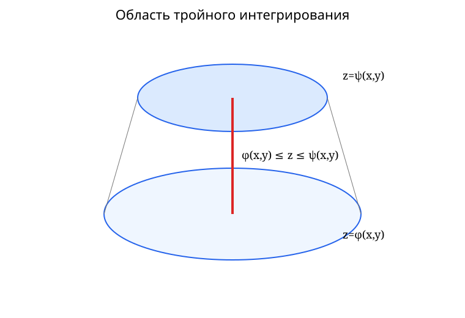

[[База знаний|← К общей базе]]

# ДЗ-1 — теория по типам задач

> [!info] Что покрывает эта страница
> В листе ДЗ-1 во всех вариантах повторяется одна и та же структура:
>
> 1. изменить порядок интегрирования;
> 2. вычислить объём тела;
> 3. вычислить объём более сложного тела;
> 4. исследовать на сходимость знакоположительные ряды;
> 5. исследовать на сходимость знакопеременные ряды.
>
> Для задач **1–3 требуется поясняющий рисунок**. Ниже собрана не теория одного конкретного варианта, а **универсальный алгоритм для каждого номера ДЗ** с разбором типичных подтипов, встречающихся в вариантах.

## Быстрая карта

| Номер | Тип задачи | Главная идея |
|---:|---|---|
| **1** | Изменить порядок интегрирования | восстановить область $D$, нарисовать её, провести сечения в новом направлении, при необходимости разбить область |
| **2** | Объём тела между поверхностями | найти проекцию $D$ и интегрировать «верхняя поверхность минус нижняя» |
| **3** | Объём тела сложной геометрии | выбрать удобные координаты: декартовы, полярные/цилиндрические или сферические |
| **4** | Знакоположительный ряд | сначала необходимый признак, затем сравнение / эквивалентность / Даламбер / Коши / интегральный признак |
| **5** | Знакопеременный ряд | сначала $a_n\to0$, затем абсолютная сходимость; если её нет — признак Лейбница |

---

# 1. Изменение порядка интегрирования

> [!source] Теория
> - [[02 — Двойные интегралы#24. Сведение двойного интеграла к повторному|Сведение двойного интеграла к повторному]]
> - [Гаврилов–Иванова–Морозова: §1.7, повторные интегралы — PDF стр. 41](<sources/Гаврилов, Иванова, Морозова — Кратные и криволинейные интегралы.pdf#page=41>)
> - [Правильные области — PDF стр. 47](<sources/Гаврилов, Иванова, Морозова — Кратные и криволинейные интегралы.pdf#page=47>)

## 1.1. Что означает исходный повторный интеграл

Если дано

$$
\int_a^b dx\int_{\varphi_1(x)}^{\varphi_2(x)} f(x,y)\,dy,
$$

то он задаёт область

$$
D=
\left\{
(x,y):
a\le x\le b,\;
\varphi_1(x)\le y\le\varphi_2(x)
\right\}.
$$

То есть при фиксированном $x$ вертикальный отрезок идёт от нижней границы

$$
y=\varphi_1(x)
$$

до верхней

$$
y=\varphi_2(x).
$$

Если дано

$$
\int_c^d dy\int_{\psi_1(y)}^{\psi_2(y)} f(x,y)\,dx,
$$

то область описывается горизонтальными сечениями:

$$
D=
\left\{
(x,y):
c\le y\le d,\;
\psi_1(y)\le x\le\psi_2(y)
\right\}.
$$

## 1.2. Алгоритм смены порядка

### Шаг 1. Выписать все границы

Из пределов интегрирования выписываем уравнения:

- $x=a$, $x=b$;
- $y=\varphi_1(x)$;
- $y=\varphi_2(x)$;

или их аналог при внешнем интегрировании по $y$.

### Шаг 2. Построить область $D$

Нужно **не переставлять символы $dx$ и $dy$ формально**, а восстановить геометрию области.

Особенно часто в ДЗ встречаются:

- прямые;
- параболы;
- окружности и полуокружности;
- гиперболы вида $xy=c$;
- области, заданные суммой двух повторных интегралов.

### Шаг 3. Найти точки пересечения границ

Точки, в которых меняется ограничивающая кривая, почти всегда становятся новыми внешними пределами или точками разбиения интеграла.

### Шаг 4. Провести сечение в новом направлении

Если было

$$
dy\,dx,
$$

то новое описание строим **горизонтальными** отрезками.

Если было

$$
dx\,dy,
$$

то новое описание строим **вертикальными** отрезками.

### Шаг 5. Решить уравнения границ относительно новой внутренней переменной

Например,

$$
y=x^2
\quad\Longrightarrow\quad
x=\pm\sqrt y.
$$

Окружность

$$
x^2+y^2=R^2
$$

даёт

$$
x=\pm\sqrt{R^2-y^2}
$$

или

$$
y=\pm\sqrt{R^2-x^2}.
$$

Гипербола

$$
xy=c
$$

даёт

$$
x=\frac cy
\qquad\text{или}\qquad
y=\frac cx.
$$

### Шаг 6. Проверить, нужен ли один интеграл или сумма

Если при движении новой секущей одна из границ меняется, область нужно разбить:

$$
\iint_D f\,dS
=
\iint_{D_1}f\,dS+
\iint_{D_2}f\,dS.
$$

Отсюда после смены порядка часто появляется **два или больше повторных интеграла**, даже если исходно был один, и наоборот.

## 1.3. Контроль правильности

После записи новых пределов проверь:

1. новая и старая запись описывают одну и ту же область;
2. каждая точка области учитывается ровно один раз;
3. нижний предел внутреннего интеграла действительно меньше верхнего;
4. точки разбиения совпадают с пересечениями кривых.

> [!warning] Типичная ошибка
> Нельзя просто «поменять местами $dx$ и $dy$». Меняется не только порядок дифференциалов, но и **вся система пределов**.

---

# 2. Объём тела, ограниченного поверхностями

> [!source] Теория
> - [[02 — Двойные интегралы#25. Геометрический и физический смысл|Геометрический смысл двойного интеграла]]
> - [[02 — Двойные интегралы#24. Сведение двойного интеграла к повторному|Повторный интеграл по правильной области]]
> - [[02 — Двойные интегралы#27. Полярные координаты|Полярные координаты]]
> - [Гаврилов–Иванова–Морозова: объём с помощью двойного интеграла — PDF стр. 51](<sources/Гаврилов, Иванова, Морозова — Кратные и криволинейные интегралы.pdf#page=51>)

## 2.1. Основная формула

Если тело расположено между поверхностями

$$
z=z_{\text{верх}}(x,y)
$$

и

$$
z=z_{\text{низ}}(x,y),
$$

то

$$
\boxed{
V=
\iint_D
\left(
z_{\text{верх}}-z_{\text{низ}}
\right)dS
}
$$

где $D$ — проекция тела на плоскость $Oxy$.

## 2.2. Как найти проекцию $D$

Проекция определяется теми боковыми поверхностями и линиями пересечения, которые ограничивают тело по $x$ и $y$.

Если две поверхности задают верх и низ, то граница их проекции часто находится из равенства

$$
z_{\text{верх}}(x,y)=z_{\text{низ}}(x,y).
$$

После этого получаем уравнение границы в плоскости $Oxy$.

Например, если после приравнивания возникает

$$
x^2+y^2=R^2,
$$

проекция — круг или его часть, и почти всегда выгодны полярные координаты.

## 2.3. Поверхности с квадратом переменной

В ДЗ встречаются поверхности вида

$$
z^2=F(x,y).
$$

Это означает две ветви:

$$
z=\pm\sqrt{F(x,y)}.
$$

Если тело находится между обеими ветвями, его высота равна

$$
\sqrt{F(x,y)}-
\left(-\sqrt{F(x,y)}\right)
=
2\sqrt{F(x,y)}.
$$

Если одна из ветвей отсечена другой поверхностью, нужно определить реальную верхнюю и нижнюю границы по рисунку и по неравенствам.

## 2.4. Если границы заданы плоскостями

Плоскость вида

$$
ax+by+cz=d
$$

при $c\ne0$ приводим к виду

$$
z=\frac{d-ax-by}{c}.
$$

Затем сравниваем поверхности и строим область $D$ по боковым ограничениям.

## 2.5. Выбор координат

### Декартовы координаты

Удобны, если проекция ограничена:

- прямыми;
- параболами вида $y=f(x)$;
- простыми вертикальными/горизонтальными границами.

### Полярные координаты

Если в проекции есть

$$
x^2+y^2,
$$

круги, кольца или секторы, используем

$$
x=r\cos\varphi,
\qquad
y=r\sin\varphi,
\qquad
dS=r\,dr\,d\varphi.
$$

## 2.6. Алгоритм задачи №2

1. Нарисовать все поверхности хотя бы схематично.
2. Определить, что является верхом и низом.
3. Найти линию их пересечения.
4. Найти проекцию $D$.
5. Выбрать декартовы или полярные координаты.
6. Записать
   $$
   V=\iint_D(z_{\text{верх}}-z_{\text{низ}})\,dS.
   $$
7. Проверить, что высота тела неотрицательна на всей области $D$.

---

# 3. Объём сложного тела

> [!source] Теория
> - [[03 — Тройные интегралы#28.1. Геометрический и физический смысл|Объём как тройной интеграл]]
> - [[03 — Тройные интегралы#30. Сведение тройного интеграла к повторному|Сведение тройного интеграла к повторному]]
> - [[03 — Тройные интегралы#32. Цилиндрические координаты|Цилиндрические координаты]]
> - [[03 — Тройные интегралы#33. Сферические координаты|Сферические координаты]]
> - [Гаврилов–Иванова–Морозова: тройной интеграл — PDF стр. 99–106](<sources/Гаврилов, Иванова, Морозова — Кратные и криволинейные интегралы.pdf#page=99>)
> - [Цилиндрические координаты — PDF стр. 119](<sources/Гаврилов, Иванова, Морозова — Кратные и криволинейные интегралы.pdf#page=119>)
> - [Сферические координаты — PDF стр. 124](<sources/Гаврилов, Иванова, Морозова — Кратные и криволинейные интегралы.pdf#page=124>)

В задачах №3 геометрия обычно сложнее, чем в №2: сферы, цилиндры, параболоиды, конусы, кольцевые области, плоскости-сечения.

## 3.1. Два равноценных подхода

### Подход A. Двойной интеграл по высоте

Если тело удобно описать как

$$
z_{\text{низ}}(x,y)
\le z\le
z_{\text{верх}}(x,y),
$$

то

$$
V=
\iint_D
(z_{\text{верх}}-z_{\text{низ}})\,dS.
$$

### Подход B. Тройной интеграл

Всегда можно использовать

$$
\boxed{
V=\iiint_Q 1\,dV
}
$$

и подобрать порядок интегрирования под геометрию тела.

## 3.2. Когда нужны цилиндрические координаты

Если тело содержит поверхности

$$
x^2+y^2=R^2,
$$

$$
z=x^2+y^2,
$$

$$
z=R^2-x^2-y^2,
$$

кольца или круговые цилиндры, вводим

$$
x=r\cos\varphi,
\qquad
y=r\sin\varphi,
\qquad
z=z,
$$

$$
dV=r\,dr\,d\varphi\,dz.
$$

Особенно удобно:

$$
x^2+y^2=r^2.
$$

### «Внутри» и «вне» цилиндра

Если сказано **внутри цилиндра**

$$
x^2+y^2\le R^2,
$$

то обычно

$$
0\le r\le R.
$$

Если сказано **вне цилиндра**, но внутри другой круговой поверхности, появляется кольцевой диапазон

$$
R_1\le r\le R_2.
$$

## 3.3. Когда нужны сферические координаты

Для сфер и тел с естественной сферической симметрией:

$$
x^2+y^2+z^2=R^2
$$

можно использовать

$$
x=\rho\sin\theta\cos\varphi,
$$

$$
y=\rho\sin\theta\sin\varphi,
$$

$$
z=\rho\cos\theta,
$$

$$
dV=\rho^2\sin\theta\,d\rho\,d\theta\,d\varphi.
$$

Сферические координаты особенно полезны, если одновременно встречаются сфера и конус с вершиной в начале координат.

## 3.4. Сфера, отсечённая плоскостью $z=h$

Для сферы

$$
x^2+y^2+z^2=R^2
$$

на уровне $z=h$ радиус горизонтального сечения равен

$$
r(h)=\sqrt{R^2-h^2}.
$$

Если задача просит объёмы частей сферы, разделённых плоскостью, можно:

- интегрировать площади круговых сечений по $z$;
- либо использовать сферические координаты;
- либо применить формулу сферического сегмента, если она разрешена в курсе.

Для базы ДЗ основной метод — **интеграл**, поскольку именно он проверяет тему кратных интегралов.

## 3.5. Пересечение сферы и параболоида

Для поверхностей вида

$$
x^2+y^2+z^2=R^2,
$$

$$
z=x^2+y^2+c
$$

сразу вводим

$$
r^2=x^2+y^2.
$$

Линия пересечения находится из системы

$$
r^2+z^2=R^2,
$$

$$
z=r^2+c.
$$

После нахождения критического $r$ область разбивается по радиусу, если верхняя или нижняя поверхность меняется.

## 3.6. Конусы

Конусы вида

$$
z^2=x^2+y^2
$$

в цилиндрических координатах имеют вид

$$
z=\pm r.
$$

Это часто значительно упрощает границы.

## 3.7. Алгоритм задачи №3

1. Опознать поверхности: сфера, цилиндр, параболоид, конус, плоскость.
2. Сделать рисунок и отметить, какая часть пространства требуется.
3. Найти линии/кривые пересечения.
4. Выбрать систему координат.
5. Записать все неравенства области.
6. Проверить, не меняется ли верхняя/нижняя граница внутри области.
7. Записать двойной или тройной интеграл.
8. Перед вычислением проверить размерность и знак объёма.

---

# 4. Знакоположительные числовые ряды

> [!source] Теория
> - [[01 — Числовые ряды#5. Необходимый признак сходимости|Необходимый признак]]
> - [[01 — Числовые ряды#8. Признак сравнения|Признак сравнения]]
> - [[01 — Числовые ряды#9. Предельный признак сравнения|Предельный признак сравнения]]
> - [[01 — Числовые ряды#10. Интегральный признак Коши|Интегральный признак Коши]]
> - [[01 — Числовые ряды#11. Ряд $\sum 1/n^p$|Ряд Дирихле]]
> - [[01 — Числовые ряды#12. Признак Даламбера|Признак Даламбера]]
> - [[01 — Числовые ряды#13. Радикальный признак Коши|Радикальный признак Коши]]
> - [Власова: признаки сходимости положительных рядов — PDF стр. 44–69](<sources/Власова — Ряды.pdf#page=44>)
> - [Демидович: признаки сходимости — PDF стр. 288–291](<sources/Демидович — Задачи и упражнения.pdf#page=288>)

## 4.1. Первый шаг — необходимый признак

Для любого ряда

$$
\sum a_n
$$

сходимость возможна только если

$$
\boxed{a_n\to0}.
$$

Поэтому **до применения Даламбера, Коши или сравнения** всегда сначала посмотри на общий член.

Если

$$
\lim_{n\to\infty}a_n\ne0,
$$

то ряд сразу расходится.

Это особенно важно для выражений вида

$$
\left(\frac{an+b}{an+c}\right)^n,
$$

тригонометрических функций, стремящихся к ненулевой константе, и рациональных дробей одинаковых степеней.

## 4.2. Предельное сравнение — основной рабочий инструмент

Если

$$
a_n\sim b_n
$$

и поведение ряда

$$
\sum b_n
$$

известно, то оба ряда имеют одинаковый характер сходимости.

Главный эталон:

$$
\sum\frac1{n^p}
$$

сходится при $p>1$ и расходится при $p\le1$.

## 4.3. Эквивалентные бесконечно малые

Во многих пунктах ДЗ аргумент тригонометрической или логарифмической функции стремится к нулю. Тогда полезны стандартные эквивалентности при $x\to0$:

$$
\sin x\sim x,
$$

$$
\tan x\sim x,
$$

$$
\arctan x\sim x,
$$

$$
\arcsin x\sim x,
$$

$$
\ln(1+x)\sim x,
$$

$$
e^x-1\sim x,
$$

$$
1-\cos x\sim\frac{x^2}{2}.
$$

После замены на эквивалент главный член часто превращается в

$$
\frac{C}{n^p}.
$$

> [!note]
> Использование эквивалентности здесь опирается на предельный признак сравнения: если $a_n/b_n\to C$, $0<C<\infty$, ряды сходятся или расходятся одновременно.

## 4.4. Рациональные выражения

Если

$$
a_n=
\frac{P(n)}{Q(n)},
$$

то сравниваем старшие степени:

$$
a_n\sim Cn^{\deg P-\deg Q}.
$$

Затем приводим к $p$-ряду.

Например, если

$$
\deg Q-\deg P=p,
$$

то

$$
a_n\sim\frac C{n^p}.
$$

## 4.5. Факториалы и длинные произведения — признак Даламбера

Если в $a_n$ есть

- $n!$;
- $(2n)!$, $(3n)!$;
- произведения вида
  $$
  1\cdot4\cdot7\cdots(3n-2);
  $$
- произведения арифметических прогрессий,

обычно сначала вычисляем

$$
\frac{a_{n+1}}{a_n}.
$$

Соседние произведения почти полностью сокращаются.

Если

$$
q=
\lim_{n\to\infty}
\frac{a_{n+1}}{a_n}<1,
$$

ряд сходится.

Если $q>1$, ряд расходится.

Если $q=1$, нужен другой признак.

## 4.6. Степени вида $b_n^n$ или $b_n^{n^2}$ — радикальный признак Коши

Если

$$
a_n=(b_n)^n,
$$

то

$$
\sqrt[n]{a_n}=|b_n|.
$$

Если

$$
a_n=(b_n)^{n^2},
$$

то

$$
\sqrt[n]{a_n}=|b_n|^n.
$$

Поэтому радикальный признак часто быстрее Даламбера для выражений, где весь сложный множитель возведён в степень, зависящую от $n$.

## 4.7. Пределы вида $\left(1+\frac{c}{n}\right)^n$

Нужно помнить стандартный предел

$$
\left(1+\frac cn\right)^n\to e^c.
$$

Если сам член ряда стремится к ненулевой константе, этого уже достаточно для расходимости по необходимому признаку.

Если такая степень является лишь частью более сложного выражения, после её оценки продолжаем сравнение остальных множителей.

## 4.8. Логарифмический эталон

В ДЗ встречаются члены с $\ln n$ в знаменателе.

Особенно важен ряд

$$
\sum_{n\ge2}
\frac1{n(\ln n)^p}.
$$

По интегральному признаку Коши:

$$
\int_2^\infty
\frac{dx}{x(\ln x)^p}.
$$

Подстановка

$$
t=\ln x,
\qquad
dt=\frac{dx}{x}
$$

даёт

$$
\int_{\ln2}^\infty\frac{dt}{t^p}.
$$

Следовательно,

$$
\boxed{
\sum_{n\ge2}\frac1{n(\ln n)^p}
\text{ сходится }\Longleftrightarrow p>1
}
$$

и расходится при $p\le1$.

## 4.9. Как выбирать признак

### Если есть рациональная функция от $n$
Используй сравнение со степенным рядом.

### Если есть $sin$, $	an$, $arctan$, $arcsin$, $ln(1+x)$, $1-\cos x$
Сначала найди малый аргумент и используй эквивалентность.

### Если есть факториалы или произведения
Сначала пробуй Даламбера.

### Если выражение целиком стоит в степени $n$ или $n^2$
Сначала пробуй радикальный признак Коши.

### Если есть $n$ и степени $\ln n$ в знаменателе
Пробуй интегральный признак и логарифмический эталон.

### Если любой признак дал пограничное значение $1$
Он **не решил задачу**. Переходи к сравнению или другому признаку.

---

# 5. Знакопеременные числовые ряды

> [!source] Теория
> - [[01 — Числовые ряды#5. Необходимый признак сходимости|Необходимый признак]]
> - [[01 — Числовые ряды#14. Абсолютная и условная сходимость|Абсолютная и условная сходимость]]
> - [[01 — Числовые ряды#15. Признак Лейбница|Признак Лейбница]]
> - [Власова: абсолютная сходимость и признак Лейбница — PDF стр. 71–83](<sources/Власова — Ряды.pdf#page=71>)
> - [Демидович: знакопеременные ряды — PDF стр. 291](<sources/Демидович — Задачи и упражнения.pdf#page=291>)

Во многих вариантах ряд имеет вид

$$
\sum_{n=1}^{\infty}
(-1)^n b_n
$$

или

$$
\sum_{n=1}^{\infty}
(-1)^{n-1}b_n,
\qquad b_n\ge0.
$$

## 5.1. Первый шаг — снова необходимый признак

Наличие $(-1)^n$ **не гарантирует сходимость**.

Обязательно проверяем:

$$
b_n\to0.
$$

Если

$$
b_n\not\to0,
$$

то

$$
(-1)^n b_n
$$

тоже не стремится к нулю и ряд расходится.

Это одна из самых частых ловушек в задаче №5.

## 5.2. Второй шаг — проверить абсолютную сходимость

Исследуем

$$
\sum |(-1)^n b_n|
=
\sum b_n.
$$

Для этого применяем все признаки знакоположительных рядов из задачи №4:

- сравнение;
- эквивалентность;
- Даламбер;
- Коши;
- интегральный признак.

Если

$$
\sum b_n
$$

сходится, исходный ряд **сходится абсолютно**.

## 5.3. Если абсолютной сходимости нет — признак Лейбница

Если

$$
b_n\downarrow
$$

начиная с некоторого номера и

$$
b_n\to0,
$$

то

$$
\sum(-1)^{n-1}b_n
$$

сходится.

Если при этом

$$
\sum b_n
$$

расходится, исходный ряд сходится **условно**.

## 5.4. Итоговая классификация

Для каждого пункта задачи №5 ответ должен быть не просто «сходится», а один из трёх:

1. **расходится**;
2. **сходится абсолютно**;
3. **сходится условно**.

## 5.5. Как доказать убывание $b_n$

Для простых выражений достаточно сравнить

$$
b_{n+1}
\quad\text{и}\quad
b_n.
$$

Для сложных выражений можно рассмотреть функцию

$$
b_n=f(n)
$$

и показать, что

$$
f'(x)<0
$$

при достаточно больших $x$.

Для признака Лейбница достаточно **монотонности начиная с некоторого номера**.

## 5.6. Типичный порядок решения

Для

$$
\sum(-1)^n b_n
$$

пиши решение в таком порядке:

### 1. Необходимый признак

$$
\lim b_n=?
$$

Если не ноль — сразу расходимость.

### 2. Абсолютная сходимость

Исследовать

$$
\sum b_n.
$$

Если сходится — исходный ряд сходится абсолютно.

### 3. Лейбниц

Если $\sum b_n$ расходится, проверить:

$$
b_n\to0,
$$

$$
b_{n+1}\le b_n
$$

с некоторого номера.

Тогда ряд сходится условно.

---

# 6. Общая таблица выбора метода

| Вид выражения | Что пробовать первым |
|---|---|
| $P(n)/Q(n)$ | предельное сравнение со $1/n^p$ |
| $\sin u_n$, $\tan u_n$, $\arctan u_n$, $\arcsin u_n$, $u_n\to0$ | эквивалентность функции её аргументу |
| $1-\cos u_n$ | $1-\cos u_n\sim u_n^2/2$ |
| $\ln(1+u_n)$ | $\ln(1+u_n)\sim u_n$ |
| $n!$, $(kn)!$, произведения | Даламбер |
| $(b_n)^n$, $(b_n)^{n^2}$ | радикальный признак Коши |
| $1/[n(\ln n)^p]$ | интегральный признак |
| $(-1)^n b_n$ | сначала $b_n\to0$, затем абсолютная сходимость, затем Лейбниц |
| круг / кольцо в области интегрирования | полярные координаты |
| цилиндр / параболоид вращения | цилиндрические координаты |
| сфера / конус | сферические или цилиндрические координаты |

---

# 7. Что обязательно должно быть в оформлении ДЗ

## Задача 1

- рисунок области $D$;
- уравнения всех границ;
- точки пересечения;
- новое разбиение области;
- новый повторный интеграл.

## Задача 2

- схематичный рисунок тела или его проекции;
- указание верхней и нижней поверхности;
- область проекции $D$;
- формула объёма;
- выбранная система координат.

## Задача 3

- рисунок тела и характерных поверхностей;
- линии пересечения;
- обоснование выбора координат;
- пределы интегрирования.

## Задача 4

Для каждого ряда:

1. общий член $a_n$;
2. проверка $a_n\to0$;
3. название признака;
4. вычисление соответствующего предела/сравнения;
5. итог: сходится или расходится.

## Задача 5

Для каждого ряда:

1. проверка $b_n\to0$;
2. исследование $\sum b_n$ на абсолютную сходимость;
3. при необходимости — условия Лейбница;
4. итог: абсолютная / условная сходимость или расходимость.

---

# 8. Связанные разделы базы

- [[01 — Числовые ряды]]
- [[02 — Двойные интегралы]]
- [[03 — Тройные интегралы]]
- [[База знаний]]

---

[[База знаний|← К общей базе]]
